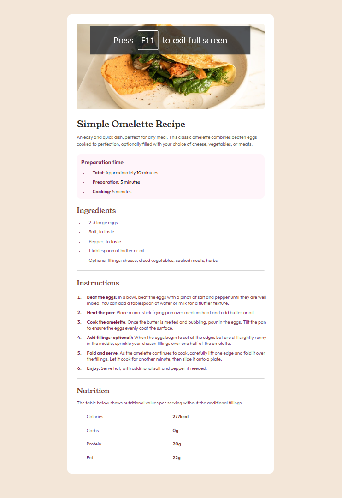

# Frontend Mentor - Recipe page solution

This is a solution to the [Recipe page challenge on Frontend Mentor](https://www.frontendmentor.io/challenges/recipe-page-KiTsR8QQKm). Frontend Mentor challenges help you improve your coding skills by building realistic projects.

## Table of contents

- [Overview](#overview)
  - [Screenshot](#screenshot)
  - [Links](#links)
- [My process](#my-process)
  - [Built with](#built-with)
  - [What I learned](#what-i-learned)
  - [Useful resources](#useful-resources)
- [Author](#author)

## Overview

### Screenshot

### Links

- Solution URL: [Add solution URL here](https://your-solution-url.com)
- Live Site URL: [Add live site URL here](https://your-live-site-url.com)

## My process

### Built with

- CSS custom properties
- Flexbox
- Desktop-first workflow

### What I learned

I learned a lot of about media queries, now I know how it works, and defenitely I will use it in next project.

### Useful resources

- [Video about css](https://www.youtube.com/watch?v=K24lUqcT0Ms) - This video is about media queries and website responsiveness.

## Author

- Website - [Kamil Popiołek](https://github.com/itzL1m4k)
- Frontend Mentor - [@itzL1m4k](https://www.frontendmentor.io/profile/itzL1m4k)